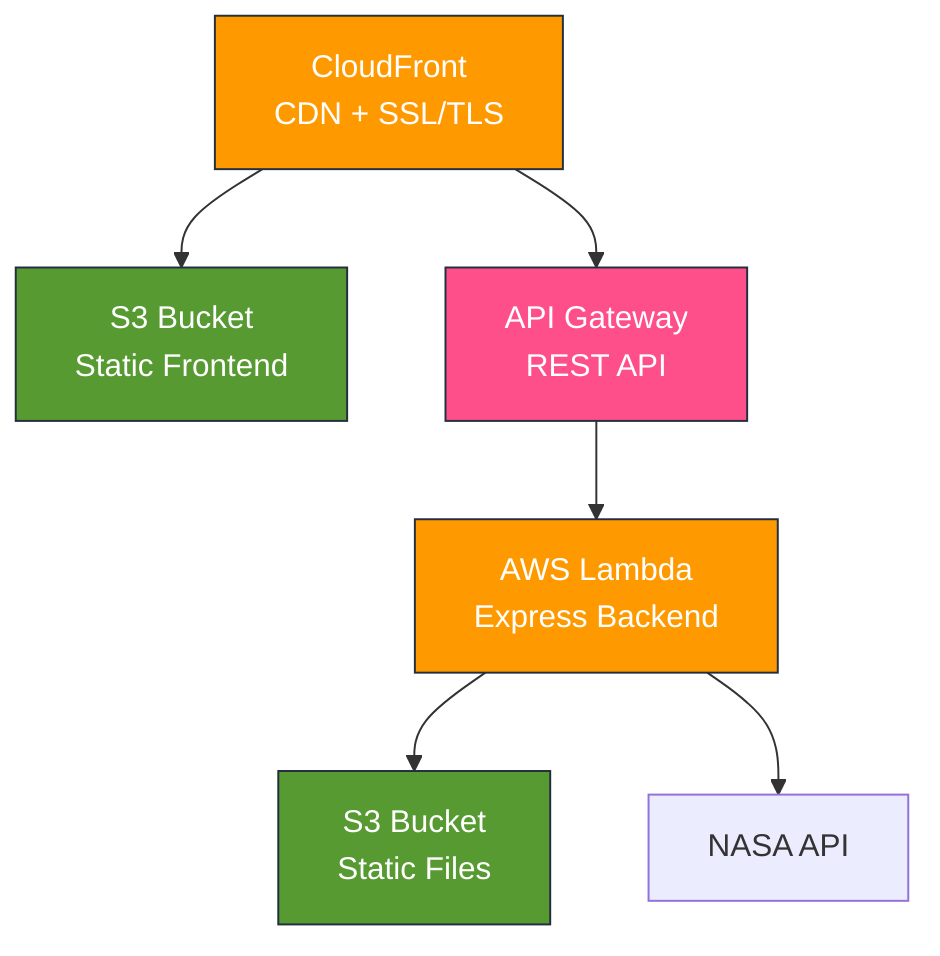

# Personal Website - Full Stack

A modern, responsive personal portfolio website showcasing projects, qualifications, and technical skills. Features a Next.js frontend deployed to AWS S3 + CloudFront and an Express.js backend running on AWS Lambda.

**Live Site:** <https://nathanpons.com>

## Overview

This full-stack application serves as a personal portfolio website featuring:

- Dynamic content including NASA's Astronomy Picture of the Day
- Detailed project showcases (web apps, Android apps, DevOps projects)
- Interactive elements like a Lights Out game recreation
- Comprehensive test coverage for both frontend and backend
- Automated CI/CD pipeline with GitHub Actions
- Cloud-native architecture using AWS services

## Tech Stack

### Frontend

- **Framework:** Next.js 15.3.3 (React 19)
- **Styling:** Tailwind CSS 4
- **Language:** TypeScript (ES6+)
- **Testing:** Jest, React Testing Library
- **Build Tool:** Next.js built-in bundler

### Backend

- **Runtime:** Node.js 24
- **Framework:** Express.js 5
- **Serverless:** AWS Lambda (via serverless-http)
- **Language:** JavaScript (ES6+ Modules)
- **Testing:** Jest, Supertest
- **Validation:** express-validator

### Infrastructure & DevOps

- **Cloud Provider:** AWS
  - S3 (static hosting)
  - CloudFront (CDN)
  - Lambda
  - API Gateway
  - CloudFormation/SAM (Infrastructure as Code)
- **CI/CD:** GitHub Actions
- **Containerization:** Docker
- **Version Control:** GitHub

### Additional Tools

- **Security:** Helmet.js, CORS middleware, rate limiting
- **Caching:** node-cache
- **Logging:** Morgan
- **API Integrations:** NASA APOD API
- **Image Optimization:** Next.js Image Component

## Features

### Frontend Features

- **Responsive Design:** Mobile-first approach with Tailwind CSS
- **Dynamic Content:** NASA Astronomy Picture of the Day integration
- **Interactive Elements:**
  - Lights Out game with adjustable grid size
  - Smooth scroll animations
  - Mobile hamburger menu
- **Project Showcases:**
  - Web applications (e-commerce, hotel reservation, world map API)
  - Android applications (vacation planner, timer, games)
  - DevOps projects (GitHub Actions, Docker, Kubernetes)
- **Performance Optimized:**
  - Static site generation
  - Image optimization
  - Lazy loading

### Backend Features

- **RESTful API:** Express.js server with modular routing
- **Rate Limiting:**
  - General API: 100 requests/15 minutes
  - NASA endpoint: 50 requests/hour
- **Caching:** Response caching with configurable TTL
- **Error Handling:** Centralized error handling with custom AppError class
- **Security:**
  - Helmet.js for security headers
  - CORS configuration
  - Input validation and sanitization
- **AWS Integration:**
  - S3 for static file serving
  - CloudFront for around the world caching through Content Delivery Network (CDN)
  - Lambda for serverless compute
  - API Gateway for HTTP routing

## Architecture

## Deployment

Automated Deployment

The project uses GitHub Actions for CI/CD. Deployment is triggered on push to the main branch

### Workflow

1. Detect changes in frontend/backend
2. Run tests for changed components
3. Build and deploy to AWS
4. Invalidate and recreate the CloudFront cache for the frontend

## Author

***Nathan Pons***

- Website: [NathanPons.com](https://nathanpons.com)
- GitHub: [@PapsBurr](https://github.com/PapsBurr)
